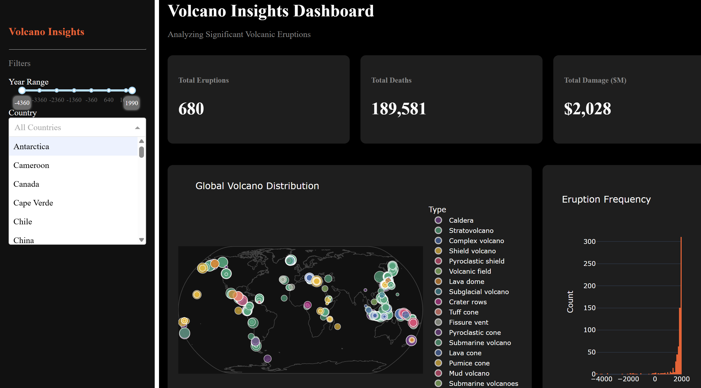

# Volcano Insights Dashboard: Data Analysis & Visualization 🌋



## 📌 Project Overview
This project applies the **Knowledge Discovery in Databases (KDD)** process to analyze and visualize the global impact of historical volcanic eruptions. The final deliverable is an interactive web dashboard built with **Python, Plotly, and Dash**, allowing users to explore the spatial distribution, temporal frequency, and economic/human impact of significant volcanic events.

## 🚀 Tech Stack
* **Language:** Python
* **Data Manipulation & Analysis:** Pandas, Jupyter Notebook
* **Data Visualization:** Plotly Express
* **Web Framework:** Dash

## 📊 Data Pipeline & Architecture (KDD Process)

The project architecture follows a structured data pipeline to transform raw, unstructured data into an interactive, user-facing application:

1. **Data Ingestion & Loading:** 
   * Sourced the NCEI Volcano Events Dataset (`volcano-events.tsv`), a comprehensive record of significant historical eruptions.
2. **Data Cleaning & Preprocessing:**
   * Standardized column names and handled missing values (NaNs) by applying appropriate domain-specific defaults.
   * Cast variables (e.g., VEI, Year, Deaths) to optimal numeric types for efficient computation.
   * Filtered anomalous records and ensured data integrity for geospatial coordinates (Latitude/Longitude).
3. **Data Transformation & Aggregation:**
   * Computed high-level Key Performance Indicators (KPIs) such as Total Eruptions, Total Deaths, and Total Financial Damage.
   * Filtered and aggregated datasets dynamically based on user-selected states.
4. **Data Mining & Visualization:**
   * **Spatial Analysis:** Global scatter mapping of volcanoes, dynamically sized by their Volcanic Explosivity Index (VEI).
   * **Temporal Analysis:** Time-series histogram tracking the frequency of recorded eruptions over millennia.
   * **Impact Analysis:** Horizontal bar charts identifying the most devastating eruptions based on human casualties.
   * **Correlation Analysis:** Log-scaled scatter plots investigating the relationship between eruption intensity (VEI) and subsequent damage/deaths.
5. **Deployment & UI Architecture:**
   * Built a reactive, modular Dash web application featuring cross-filtering capabilities (Year Range Slider, Country Dropdown).
   * Designed a dark-themed, responsive user interface with CSS to emphasize data visibility.

## 💡 Key Dashboard Features
* **Dynamic KPIs:** Real-time updates of core metrics based on user interactions.
* **Interactive Filtering:** A unified state management system where updating the year slider or selecting a country instantly filters all downstream charts.
* **Modular Codebase:** The application logic is separated into distinct analysis domains (Spatial, Temporal, Impact, Correlation) for maintainability, scalability, and collaborative development.

## 🏃‍♂️ How to Run Locally

1. Clone the repository and navigate to the project directory.
2. Ensure you have the required dependencies installed:
   ```bash
   pip install pandas plotly dash
   ```
3. Run all cells in the Jupyter Notebook (`main.ipynb`) to launch the local Dash server.
4. Access the dashboard at `http://127.0.0.1:7860/` in your web browser.
